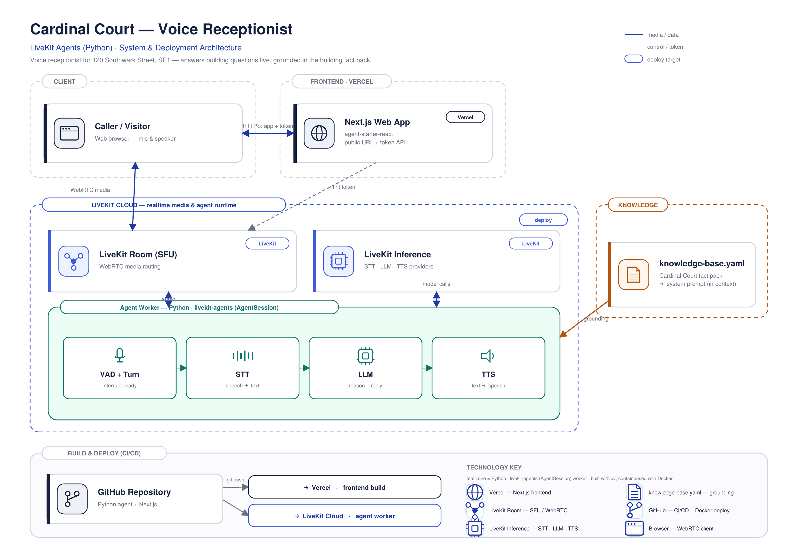

# cardinal-court-receptionist

A LiveKit voice agent acting as the front desk for Cardinal Court, 120 Southwark Street, London SE1. Grounded answers from the building fact pack — and an honest "I don't have that information" when the question falls outside it.

---

## Handback checklist

- [x] LiveKit voice agent (speech-in/out), deployed to LiveKit Cloud, auto-dispatch
- [x] Reachable from a public URL (Vercel)
- [x] Grounded in the Cardinal Court fact pack, with refusal behaviour
- [x] Public GitHub repo with README (how to run / what was used / what I'd improve / time spent)
- [ ] **Manually voice-tested end to end on the live URL** (mic in, speaker out) — do this before sending to Nathan
- [x] Demo recording (Google Drive)

---

## Demo

| | |
|---|---|
| **▶ Demo recording** | [](https://drive.google.com/file/d/1Pn6_YPAIdYhBZgRMNHjuphJ4EzJpYf9w/view?usp=sharing) |
| **↗ Live URL** | https://cardinal-court-receptionist.vercel.app |

**Before you test it:** give it a couple of seconds to connect after clicking "Start call" — the agent has to be dispatched into the room. Best tested in Chrome.

---

## Problem

Visitors and couriers arriving at Cardinal Court ask the same questions: which floor is a company on, where do deliveries go, how do I get here, is there step-free access. A human receptionist handles these, but the desk isn't always staffed and calls go unanswered out of hours.

**Scope statement.** One complete slice: a voice agent that answers building questions from the fact pack, behaves like a front desk, and refuses to invent answers. It does not book meeting rooms, manage access passes, handle multi-building queries, or do anything not in the fact pack — those were cut deliberately to spend the time budget on accurate grounding and behaviour.

---

## Architecture



Caller connects via WebRTC to a LiveKit Room. The agent worker (`AgentSession`) is auto-dispatched into the room and streams audio through VAD → STT → LLM → TTS. STT (`deepgram/nova-3`), LLM (`openai/gpt-4.1-mini`) and TTS (`cartesia/sonic-3`) all route through **LiveKit Inference**, so the only credentials needed are the three LiveKit Cloud keys. The frontend (LiveKit's `agent-starter-react`, deployed to Vercel) mints the access token and joins the same room. `knowledge-base.yaml` is compiled into the system prompt at startup — no retrieval round trip.

---

## Approach & key decisions

- **In-context KB, not RAG.** The fact pack is ~2,300 tokens — it fits in the system prompt with headroom. No per-turn retrieval means lower latency and no split-context failures on questions that need two facts at once (e.g. Loom on floors 3 and 4, courier routing to lower ground not floor 1). RAG would earn its place if the building count grew or the fact pack exceeded context limits.
- **`lookup_tenant` function tool alongside in-context KB.** Gives the LLM a typed confirm path for company name lookups, and demonstrates tool use without requiring retrieval.
- **gpt-4.1-mini, not a larger model.** First-token latency dominates voice UX. A fast-streaming model beats a smarter slow one for a receptionist.
- **Refusal is a feature.** The system prompt instructs the agent to say "I don't have that information" rather than guess. The eval set tests this path explicitly.
- **Structured YAML knowledge base.** `knowledge-base.yaml` is the single source of truth. Compiled deterministically into the prompt at startup — the KB and the agent can't drift apart.
- **No re-ranker, no vector DB, no frontend code.** All three were cut deliberately. The corpus is tiny. The frontend is LiveKit's own `agent-starter-react` — using it as-is rather than rebuilding.

---

## Evaluation

```bash
pytest evals/ -v
```

Runs 13 questions from the fact pack's own sample set through the LLM with the full system prompt — text-only, no voice round trip. Metric: all `expect_contains` phrases must appear in the response; refusal tests check no answer is invented.

#### Results

Correctness on the golden set: **13/13 = 1.00**, including three graceful-failure cases the agent correctly refuses.

Known failure modes:
- **ASR errors not caught.** The eval is text-only. Deepgram mishearing "Kiln" as "kill" or "Loom" as "room" bypasses the confirm-before-directing guardrail in the prompt. Would need voice-round-trip eval or ASR confusion testing to lock in.
- **Substring metric only.** A verbose answer scores the same as a tight one. Tone and conciseness are not measured.

---

## What I'd improve with more time

- **The `/api/token` route has no auth layer.** It's LiveKit's own starter template, which deliberately throws in production unless you add one — I removed that guard to get a working public demo link, which is the right tradeoff for this exercise (no real users, no cost at risk) but not for production. With more time: a lightweight auth/rate-limit layer in front of token minting, or LiveKit Cloud's sandbox token flow.
- **ASR confusion on tenant names isn't tested.** "Loom" → "lune", "Kiln" → "kill" — the eval set is text-only, so these failure modes aren't caught. Would need a voice-round-trip eval or explicit ASR confusion test cases.
- **MCP server for the building data**, instead of baking it into the prompt — cleaner architecture, independently testable, and the direction LiveKit's SDK is heading. Deferred because the fact pack is small enough that in-context grounding is the right call for V1.
- **RAG + retrieval evaluation** — only worth it if the fact pack grows past prompt-context size; deferred for the same reason.
- **Telephony (LiveKit SIP), multi-language, fuller traces/eval set** — all brief stretch goals, none required for the core build.

## Roughly where the time went

~3 hours, in line with the brief's time box:
- Planning + LiveKit Cloud setup + credentials: ~25 min
- Grounding (YAML knowledge base, system prompt, refusal/multi-fact behaviour, `lookup_tenant` tool): ~45 min
- Testing pass against the fact pack's sample questions, including the awkward refusal cases: ~30 min
- Deployment (agent worker → LiveKit Cloud, frontend → Vercel, end-to-end verification): ~40 min
- Evals (`golden.yaml` + pytest) and this README: ~25 min

---

## How to run

**Prerequisites:** Python 3.12, and a free [LiveKit Cloud](https://cloud.livekit.io) project (Settings → Keys gives you the three credentials below). STT/LLM/TTS run through LiveKit Inference — no other provider accounts needed.

### 1. The agent

```bash
git clone [repo-url] && cd cardinal-court-receptionist
python3.12 -m venv venaglass && source venaglass/bin/activate
pip install -r requirements.txt
cp .env.example .env        # fill in LIVEKIT_URL, LIVEKIT_API_KEY, LIVEKIT_API_SECRET
cd agent && python agent.py dev
```

**Talk to it in the terminal (no UI needed):** swap `dev` for `console` — the full pipeline runs through your mic and speaker. Quickest way to verify the agent works.

### 2. The frontend (LiveKit's UI — not built here)

The browser UI is LiveKit's official [`agent-starter-react`](https://github.com/livekit-examples/agent-starter-react), used as-is. It is **not vendored into this repo** — clone it separately:

```bash
git clone https://github.com/livekit-examples/agent-starter-react
cd agent-starter-react
cp .env.example .env.local   # same three LIVEKIT_* values; leave AGENT_NAME blank for auto-dispatch
corepack pnpm@9.15.9 install
corepack pnpm@9.15.9 dev     # http://localhost:3000
```

With both running, open `http://localhost:3000`, click **Connect**, allow the mic — the agent is auto-dispatched into the room and greets you.

---

## Deployment

Two independent deployments — the agent worker and the UI:

| Component | Target | Command |
|---|---|---|
| Agent worker | LiveKit Cloud (managed) | `lk cloud auth && lk agent create && lk cloud deploy` |
| Frontend UI | Vercel | Import the `agent-starter-react` repo → set the 3 `LIVEKIT_*` env vars → Deploy |

The agent is **not** deployed to Vercel — it is a long-running WebRTC worker, which Vercel's serverless model can't host. Both deployments point at the same LiveKit project via the three credentials; auto-dispatch connects them.

---

## Repository layout

```
cardinal-court-receptionist/
├── agent/
│   ├── agent.py              # AgentServer entrypoint — Agent subclass + lookup_tenant tool
│   ├── knowledge.py          # loads YAML, compiles system prompt, lookup_tenant()
│   └── knowledge-base.yaml   # single source of truth — the full fact pack, structured
├── evals/
│   ├── conftest.py           # pytest fixture — ask(question) → LLM response
│   ├── test_golden.py        # 13 named tests, one per acceptance question
│   └── golden.yaml           # question → expect_contains / expect_behavior pairs
├── docs/
│   └── cardinal-court-architecture.png
├── Dockerfile                # for lk cloud deploy or self-hosting
├── .env.example
├── .gitignore
├── requirements.txt
└── README.md
```

The browser UI ([`agent-starter-react`](https://github.com/livekit-examples/agent-starter-react)) lives in its own repo and is deployed separately — deliberately not vendored here.
